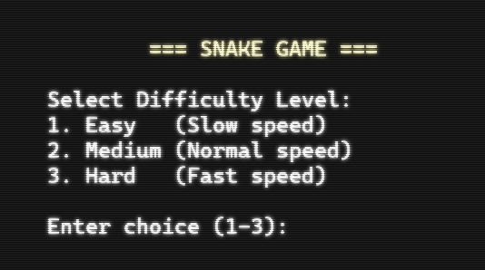
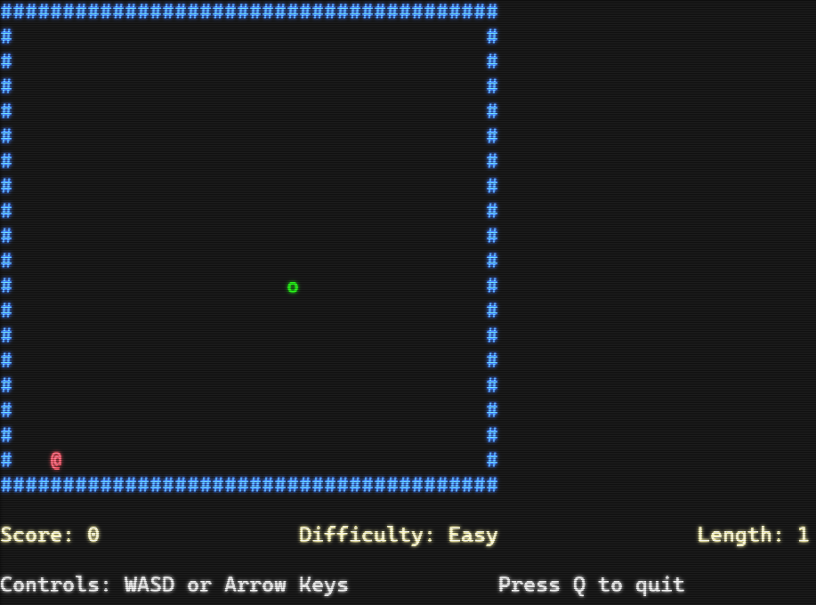
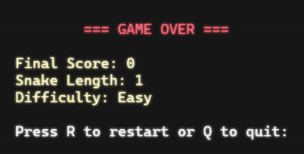

# 🐍 Snake Game - C++ Console Edition

A classic Snake game implemented in C++ with modular code structure.

<!-- Centered avatar -->
<pre align="center">
     ____              _       
  / ___| _ __   __ _| | _____
  \___ \| '_ \ / _` | |/ / _ \
   ___) | | | | (_| |   <  __/
  |____/|_| |_|\__,_|_|\_\___|
         S N A K E   ++
</pre>

<p align="center">
  <a href="https://www.linkedin.com/in/YOUR_LINKEDIN_ID/" target="_blank">
    
  </a>
  <a href="https://discord.gg/YOUR_INVITE" target="_blank">
    
  </a>
  <a href="https://YOUR_CHAT_URL" target="_blank">
    
  </a>
  <a href="https://github.com/NgoThiVanGiang/2008299410_Snake_game/wiki" target="_blank">
    
  </a>
</p>


## 🖼️ Screenshots

### 🟢 Welcome Screen


### 🎮 Gameplay Screen


### 💀 Gameover Screen


## ✨ Features

- 🐍 Classic Snake gameplay with score tracking
- ⚙️ Three difficulty levels (Easy, Medium, Hard)
- 📦 Modular code structure for easy maintenance
- 🎨 Colorful console interface

## 🎮 Controls

- ⬆️ / ⬇️ / ⬅️ / ➡️  → Move the snake (Arrow keys)  
- **W / A / S / D** → Alternative movement keys  
- **R** → Restart the game after Game Over  
- **Q** → Quit the game after Game Over  

## Compilation and Running

### Method 1: Using the batch file (Windows)
```bash
build_and_run.bat
```

### Method 2: Manual compilation (Windows)
```bash
g++ -Wall -Wextra -std=c++11 main.cpp SnakeGame.cpp -o snake_game.exe
snake_game.exe
```

### Method 3: Using Makefile (if you have make installed)
```bash
make
./snake_game.exe
```

## 🧱 Code Structure

- `main.cpp`: Entry point of the application
- `SnakeGame.h`: Header file containing class declaration
- `SnakeGame.cpp`: Implementation file with all game logic
- `Makefile`: For building the project with make
- `build_and_run.bat`: Windows batch file for easy compilation and execution

## 💻 Requirements

- 🪟 Windows OS (due to Windows-specific console functions)
- 🧰 C++ compiler (g++ recommended)