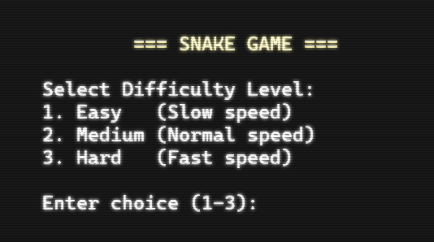
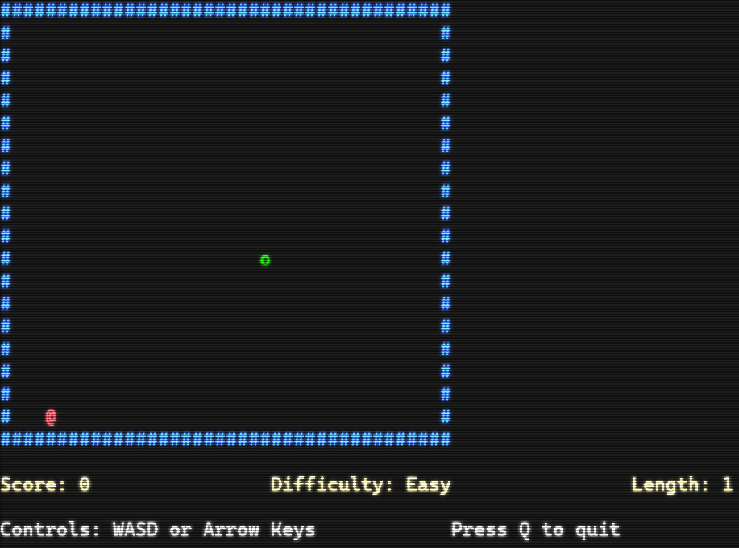
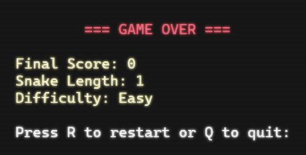

# 🐍 Snake Game - C++ Console Edition

A classic Snake game implemented in C++ with modular code structure.

<!-- Centered avatar -->
<pre align="center">
     ____              _       
  / ___| _ __   __ _| | _____
  \___ \| '_ \ / _` | |/ / _ \
   ___) | | | | (_| |   <  __/
  |____/|_| |_|\__,_|_|\_\___|
         S N A K E   ++
</pre>

  
  
  
  

## 📖 Introduction
🐍 Snake Game (C++ Console Edition) 🐍

Welcom to the classic Snake game reinvented in C++, featuring a modular design, colorful console interface, and builtin customization to suit different skill levels.
This project, created as a final assignment for a Professional Skills course by Group 7, tries to replicate the  nostalgic arcade gameplay on the Windows console. It showcases:
- Authentic classic Snake mechanics with score tracking and simple yet satisfying gameplay.
- A modular code structure that cleanly separates implementation logic (SnakeGame.cpp) from declarations (SnakeGame.h) and entry point (main.cpp).
- A visually engaging interface, complete with welcome, gameplay, and gameover screens rendered in text graphics.
- Three difficulty modes: Easy, Medium, Hard; players can choose the pace and challenge that suits them.
- Flexible controls, supporting both arrow keys (↑)(↓)(←)(→) and [W][A][S][D], along with convenient options for replay or exit using [R] (restart) or [Q] (quit) after the game ends.
- Easy to access, just run SnakeGame.exe and it's ready to play, no installation needed.

## 🎮 How to Play
Once the game starts, you’ll experience:

- A welcome screen with game title and instructions.
- Gameplay begins with a snake that moves continuously. Feed it by collecting items, but avoid walls and your own tail—doing so ends the game.
- Navigate the direction where the snake head to using arrow keys (↑)(↓)(←)(→) or [W][A][S][D] keys for movement.
- After a “Game Over,” press:
[R] to restart and try again.
[Q] to quit the game.
- The number ber of food your snake ate is your point.
## 📝 Tips & Strategy
- Start Slow: if you're new to the game, begin with Easy mode to get casual familiarity with turning and edge behavior.
- Pick a Comfortable Key Layout: Some players prefer arrow keys; others find WASD more intuitive—choose what feels natural.
- Mindful Movement: Plan your path early, beware of available space. As the snake grows, maneuvering without colliding gets trickier.
- Replay and Improve: Each restart offers insight—adjust your strategy to last longer and score higher.
- Use Difficulty Gradually: Once comfortable, try Medium or Hard to increase speed and challenge.

## 📖 Giới Thiệu
🐍 Trò chơi Rắn Săn Mồi (C++ Console Edition) 🐍

Chào mừng bạn đến với phiên bản Rắn săn mồi kinh điển được viết lại bằng C++, với thiết kế module gọn gàng, giao diện console đầy màu sắc và các chế độ tùy chỉnh phù hợp cho nhiều cấp độ người chơi.

Dự án này được thực hiện như một bài tập cuối kỳ trong môn Kỹ năng nghề nghiệp của Nhóm 7, nhằm tái hiện lại cảm giác hoài niệm của game arcade ngay trên màn hình console Windows. Trò chơi có các điểm nổi bật:

- Cơ chế rắn săn mồi chuẩn cổ điển, có tính điểm, lối chơi đơn giản nhưng hấp dẫn.
- Cấu trúc mã nguồn module rõ ràng, tách biệt phần xử lý (SnakeGame.cpp), khai báo (SnakeGame.h) và điểm bắt đầu (main.cpp).
- Giao diện trực quan, có màn hình chào mừng, màn chơi và màn hình Game Over bằng đồ họa ký tự.
- Ba cấp độ khó: Dễ, Trung bình, Khó – người chơi có thể chọn tốc độ và thử thách phù hợp.
- Điều khiển linh hoạt: hỗ trợ cả phím mũi tên (↑)(↓)(←)(→) và các phím [W][A][S][D]. Sau khi thua, người chơi có thể nhấn R để chơi lại hoặc Q để thoát.
- Cực kỳ tiện lợi: chỉ cần chạy SnakeGame.exe là chơi ngay, không cần cài đặt.

## 🎮 Cách Chơi

Ngay khi bắt đầu, bạn sẽ thấy:

- Màn hình chào mừng với tên trò chơi và hướng dẫn ngắn gọn.
- Con rắn di chuyển liên tục. Nhiệm vụ của bạn là điều khiển rắn ăn mồi để dài ra, đồng thời tránh va vào tường và chính cơ thể mình. Nếu chạm chướng ngại, trò chơi kết thúc.
- Điều khiển hướng đi của đầu rắn bằng phím mũi tên (↑)(↓)(←)(→) hoặc các phím [W][A][S][D].
- Khi thua, bạn có thể:
Nhấn [R] để chơi lại.
Nhấn [Q] để thoát game.
- Số mồi mà rắn ăn được sẽ là số điểm của của người chơ.
## 📝 Mẹo & Chiến Thuật

- Bắt đầu chậm rãi: Nếu bạn mới chơi, hãy chọn chế độ Dễ để làm quen với cách rẽ và va chạm.
- Chọn cách điều khiển thoải mái: Một số người thích  (↑)(↓)(←)(→) , một số khác lại quen với các phím [W][A][S][D] – hãy chọn phù hợp với thói quen của bạn.
- Di chuyển có tính toán: Lập kế hoạch sớm và chú ý không gian xung quanh. Khi rắn dài ra, việc né tránh trở nên khó khăn hơn.
- Chơi lại và cải thiện: Mỗi lần chơi lại giúp bạn rút kinh nghiệm, từ đó kéo dài thời gian sống sót và đạt điểm cao hơn.
- Tăng dần độ khó: Khi đã quen, hãy thử Trung bình hoặc Khó để tăng tốc độ và thử thách.

## 🖼️ Screenshots

### 🟢 Welcome Screen

### 🎮 Gameplay Screen

### 💀 Gameover Screen

## ✨ Features

- 🐍 Classic Snake gameplay with score tracking
- ⚙️ Three difficulty levels (Easy, Medium, Hard)
- 📦 Modular code structure for easy maintenance
- 🎨 Colorful console interface

## 🎮 Controls

- ⬆️ / ⬇️ / ⬅️ / ➡️  → Move the snake (Arrow keys)  
- **W / A / S / D** → Alternative movement keys  
- **R** → Restart the game after Game Over  
- **Q** → Quit the game after Game Over  

## 🧱 Code Structure

- `main.cpp`: Entry point of the application
- `SnakeGame.h`: Header file containing class declaration
- `SnakeGame.cpp`: Implementation file with all game logic
- `Makefile`: For building the project with make
- `build_and_run.bat`: Windows batch file for easy compilation and execution

## 💻 Requirements

- 🪟 Windows OS (due to Windows-specific console functions)
- 🧰 C++ compiler (g++ recommended)
